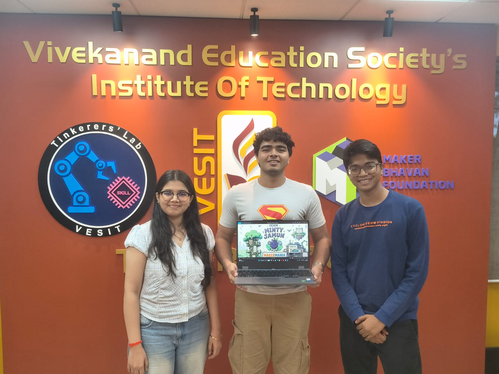

# MAKERMANIA 2026

## Innovation Project Workbook

> Program Duration: 1 June 2026 – 4 July 2026
>
> Location: MBF Tinkerers' Lab 007
>
> Team Size: 3–5 Students
>
> Goal: Identify a real-world problem and develop an innovative, patentable, and implementable solution.

---

## 🔨 Knocking Hammer

**Protect Your Knuckles. Knock with Confidence.**

The Knocking Hammer is a simple ergonomic tool designed to help users knock on doors without directly impacting their knuckles, reducing discomfort while providing a consistent knocking experience.

🎥 Demo Video: https://youtube.com/shorts/bD19YGxGuTQ?si=1oJ4QhMyKx1h3Qpc

📂 DOCUMENTATION: https://github.com/adarshgupta-web/MakerMania-2026-MintyJamun/tree/main/USELESS_PRODUCT

# 1. Team Identity

## 1.1 MintyJamun

  

---

## 1.2 Team Members

### Team Members

| Name | Role | Year | Branch | Skills |
|:-----|:-----|:-----|:--------|:--------|
| Shanchita Chauhan | Documentation, Research & Development | F.E. | AURO | ESP32 Programming, Arduino Development, CAD Modeling, Circuit Design, Wokwi Simulation,Sensor Fusion |
| Adi Kalra | Documentation, Design & Research | S.E. | EXTC | CAD Design, Embedded Systems, KiCad PCB Design |
| Adarsh Gupta | Team Lead, Documentation, Product Design & Prototyping | S.E. | AURO | CAD Modeling, Prototyping, Electronics Integration, Embedded System |

# 2. Problem Discovery

## 2.1 Observation Area

Where did you conduct your observations?

* Hostel
* Canteen
* Workshop
* Hospital
* Public Transport
* Home
* Other

---

## 2.2 AEIOU Observation Sheet

### Activities

What are users doing?

Studying, working, attending online classes, reading, or focusing on tasks. 
Frequently checking their phones during these activities. 
Switching between productive apps and distracting apps (social media, games, short-video platforms). 
Attempting to maintain focus but getting distracted by habitual phone usage.

### Environment

What conditions affect them?

Presence of phone notifications and easy access to distracting apps. 
Long work or study sessions that lead to reduced concentration. 
Situations where some phone usage is necessary (calls, emails, messages) while distractions should be avoided.

### Interactions

Who or what are they interacting with?

The anti-distraction wristband. 
The companion mobile application used to configure restrictions.

### Objects

What tools or products are used?

Bluetooth-enabled wristband. 
Companion mobile application. 
Vibration motor and microcontroller (e.g., ESP32-C3). 
Productivity and distracting applications

### Users

Who are the primary users?

Students preparing for exams or attending classes. 
College students working on assignments and projects. 
Professionals who need to stay focused while working. 
Individuals trying to reduce screen time and social media addiction. 
Anyone seeking better productivity and concentration habits. 
Non invasive productivity monitoring for corporate enviroments.

---

## 2.3 Observation Log

| Observation                         | Evidence                          | Pain Point                             |
| -----------                         | --------                          | ----------                             |
|Users frequently open social media apps while studying or working. | During observation/interviews, users reported checking Instagram, YouTube, or WhatsApp repeatedly. | Loss of focus and reduced productivity.| 
|Existing app blockers are often disabled or bypassed. |Users stated they uninstall blockers or ignore notifications.| Current solutions are easy to ignore.|
|Many users use phones for both productive and distracting tasks.|Users need phones for emails, calls, notes, and study material.|Complete blocking is impractical.|
|Users often realize they are distracted only after spending significant time on an app. |Users reported "just checking for a minute" and ending up scrolling for much longer. |Lack of immediate awareness of distraction.|
---

# 3. User Research

## 3.1 Interview Summary

Number of users interviewed: ______

## 3.2 Key Quotes

1.

2.

3.

---

## 3.3 User Persona

### Name

### Age

### Occupation

### Goals

### Frustrations

### Needs

---

# 4. Problem Framing

## Problem Statement

User __________ needs a way to __________ because __________.

---

## How Might We Questions

1.

2.

3.

---

## Opportunity Ranking

| Criteria         | Score |
| ---------------- | ----- |
| Severity         |       |
| Frequency        |       |
| Feasibility      |       |
| Novelty          |       |
| Market Potential |       |
| Total            |       |

---

# 5. Solution Ideation

## Brainstormed Ideas

| Idea | Advantages | Challenges |
| ---- | ---------- | ---------- |
|      |            |            |
|      |            |            |

---

## Selected Concept

Why was this concept chosen?

---

# 6. System Design

## High-Level Description

Explain your solution.

---

## Block Diagram

Insert diagram here.

---

## Inputs

List sensors, user inputs, data sources.

---

## Outputs

List displays, actuators, software outputs.

---

# 7. Technical Planning

## Electronics

| Component | Purpose |
| --------- | ------- |
|           |         |
|           |         |

---

## Software

| Tool | Purpose |
| ---- | ------- |
|      |         |
|      |         |

---

## Mechanical / CAD

Describe fabricated components.

---

# 8. Prototype Development

## Version 1

Description:

Lessons Learned:

---

## Version 2

Description:

Lessons Learned:

---

## Final Prototype

Description:

---

# 9. Testing & Validation

## Testing Plan

| Test | Success Criteria |
| ---- | ---------------- |
|      |                  |
|      |                  |

---

## User Feedback

| User | Feedback | Action Taken |
| ---- | -------- | ------------ |
|      |          |              |

---

# 10. Innovation Assessment

## Existing Solutions

List competing products.

---

## What Makes This Different?

---

## Innovation Score

| Parameter       | Score |
| --------------- | ----- |
| Novelty         |       |
| Technical Depth |       |
| Feasibility     |       |
| Impact          |       |
| Scalability     |       |

---

# 11. Intellectual Property

## Prior Art Search

Patents / Products Found:

---

## Novel Features

1.

2.

3.

---

## Provisional Patent Draft

### Title

### Abstract

### Problem

### Solution

### Claims

---

# 12. Business & Deployment

## Target Users

---

## Estimated Cost

---

## Market Opportunity

---

## Sustainability Considerations

---

# 13. Final Demonstration

## Prototype Images

Insert photos.

---

## Demonstration Video Link

---

## GitHub Repository

---

## Presentation Link

---

# 14. Reflection

## What Worked Well?

---

## What Failed?

---

## Key Learnings

---

## Next Steps

* Patent Filing
* Startup Exploration
* Product Development
* Research Publication
* Competition Submission

---

# 15. Final Deliverables Checklist

* Problem Discovery Complete
* User Interviews Complete
* Persona Created
* Problem Statement Finalized
* System Design Complete
* Prototype Demonstrated
* Testing Completed
* Patent Draft Prepared
* Presentation Submitted
* GitHub Repository Updated

---

# MAKERMANIA FINAL PITCH

Each team will present:

1. Problem
2. User Research
3. Insights
4. Solution
5. Prototype Demo
6. Innovation & Patentability
7. Future Roadmap

Presentation Time: 5 Minutes

Q&A: 3 Minutes
