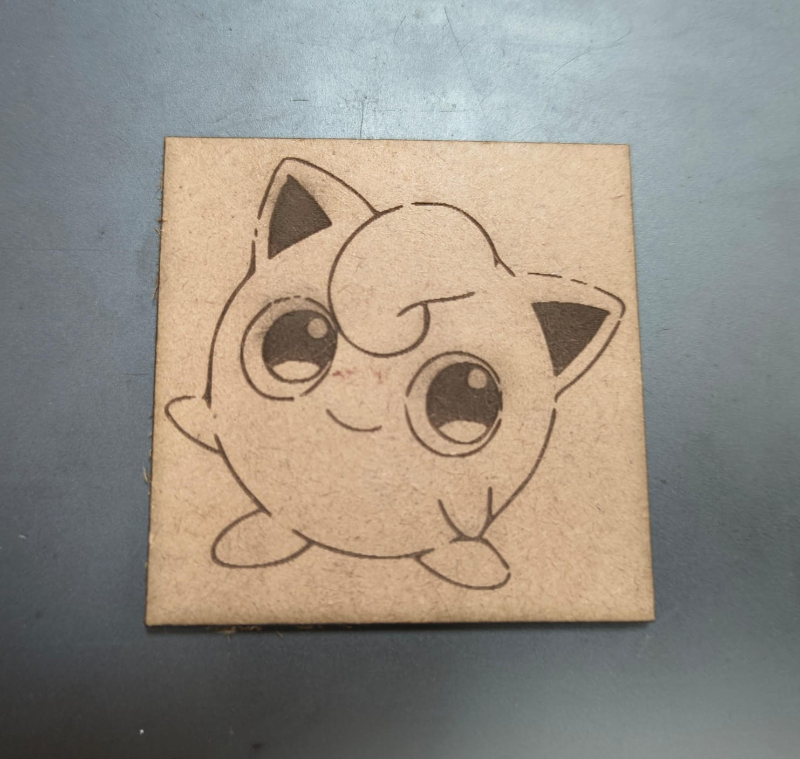

# CAD and Digital Fabrication Practice

This folder contains practice CAD models, STL files, and design assets created by Team Minty Jamun as part of our learning journey in CAD design, digital fabrication, and rapid prototyping.

## Team Members

* Adarsh Gupta
* Shanchita Chauhan
* Adi Kalra

## Contents

* Practice CAD models
* STL files for 3D printing
* Laser cutter design files
* Design screenshots and reference images
* Learning and experimentation projects

## Learning Activities

During our training and practice sessions, we explored:

* Creating CAD models using Fusion 360
* Preparing designs for laser cutting using LaserCAD
* Generating STL files for additive manufacturing
* Preparing models for 3D printing using Bambu Studio
* Understanding the complete design-to-fabrication workflow

## Software Used

* Fusion 360
* LaserCAD
* Bambu Studio

## Laser Cutter Practice

The included laser cutter design files and images were created as part of our digital fabrication training. These exercises helped us understand design preparation, machine workflows, file formats, and manufacturing constraints involved in laser cutting processes.

Designed and fabricated by Shanchita Chauhan.

## Purpose

This folder serves as a record of our practice work, experimentation, and skill development in CAD modeling, digital fabrication, and rapid prototyping.

## Note

The files in this folder are learning and practice materials and are not part of the final MakerMania project prototype.
