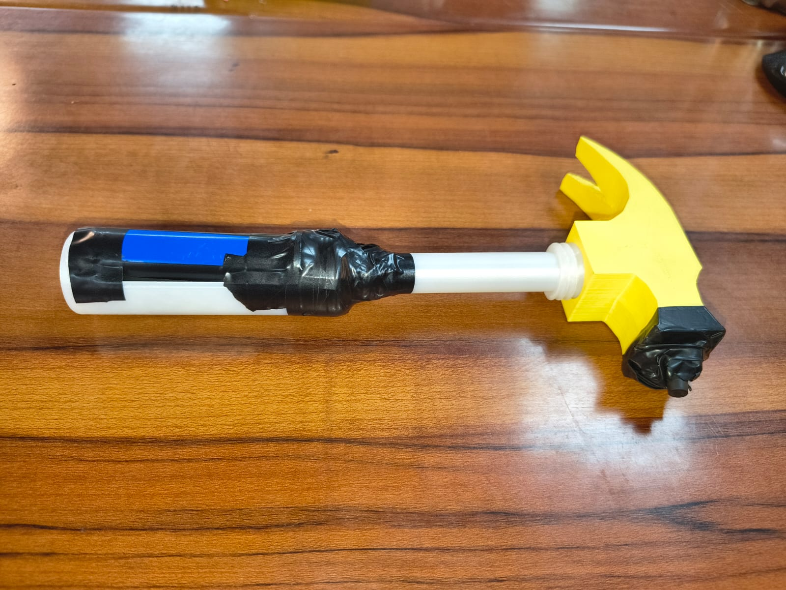
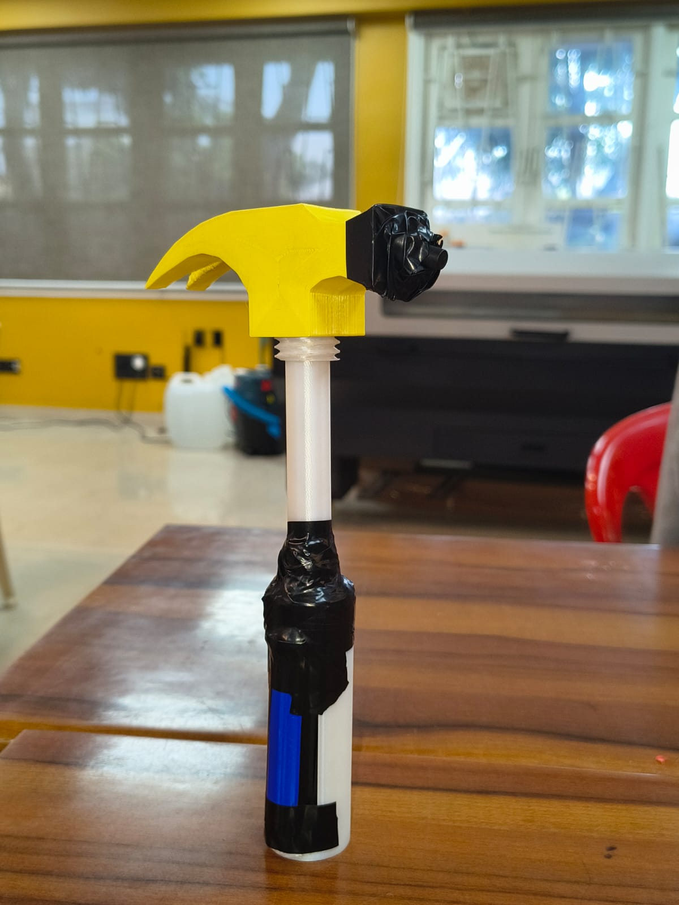

# 🔨 Knocking Hammer

### Protect Your Knuckles. Knock with Confidence.

The Knocking Hammer is a creatively engineered product developed as part of the **MakerMania 2026 Useless Product Challenge**.

The idea originated from a simple observation: knocking on hard doors repeatedly can sometimes be uncomfortable for the knuckles. While this is not a major real-world problem, it inspired us to design a dedicated tool that allows users to knock on doors without directly impacting their hands.

The result is the **Knocking Hammer** — a lightweight handheld device that acts as an intermediary between the user and the door, providing a fun and unconventional solution to a minor inconvenience.

---

## 🎯 Challenge Context

As part of the MakerMania challenge, participants were tasked with designing and prototyping a **useless or unnecessarily engineered product**.

Instead of creating a completely impractical object, we explored an everyday action that most people perform without thinking — knocking on a door.

This led to the question:

> "What if there was a dedicated tool for knocking on doors while protecting your knuckles?"

The answer was the Knocking Hammer.

---

## 💡 Problem Statement

When knocking on hard surfaces such as wooden or metal doors, users may experience minor discomfort or impact on their knuckles.

Although this issue is generally insignificant, the project demonstrates how engineering and product design can be applied to even the smallest everyday interactions.

---

## 🛠 Solution

The Knocking Hammer provides a dedicated knocking interface that allows users to:

- Knock on doors without direct knuckle contact
- Generate a clear knocking sound
- Improve comfort during repeated knocking
- Add an unnecessarily specialized tool to a very simple task

---

## ✨ Features

- Knuckle protection during knocking
- Ergonomic handheld design
- Lightweight construction
- Portable and easy to use
- Custom CAD-designed body
- 3D printable structure

---

## 🔩 Bill of Materials (BOM)

| Component | Quantity |
|------------|-----------|
| 18650 Li-ion Battery | 1 |
| Push Button | 1 |
| Buzzer | 1 |
| Connecting Wires | As Required |
| 3D Printed Components | 1 Set |

---

## ⚙ Working Principle

1. The user holds the Knocking Hammer.
2. The push button activates the buzzer.
3. The buzzer generates a knocking-like sound.
4. The user can announce their presence without directly using their knuckles.

---

## 🖥 CAD & Fabrication

The product was designed using CAD software and fabricated through 3D printing.

### Design Objectives

- Comfortable grip
- Compact form factor
- Easy assembly
- Lightweight construction

STL files are available in the **CAD** folder.
https://github.com/adarshgupta-web/MakerMania-2026-MintyJamun/tree/main/USELESS_PRODUCT/CAD

---

## 📸 Prototype Images

 

---

## 🎥 Demonstration Video

Watch the project demonstration here:

**YouTube Link:**https://youtube.com/shorts/bD19YGxGuTQ?si=LN4AMUAWA-9_MZzt)

---

## 🏆 MakerMania 2026

Developed as part of the MakerMania 2026 Innovation Program at VES Institute of Technology.

*"Engineering creativity isn't always about solving big problems — sometimes it's about finding innovative solutions to problems nobody asked to solve."*
